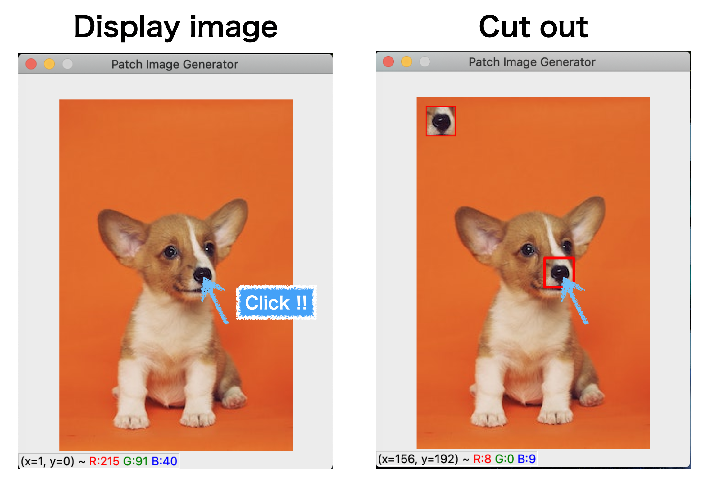

# Patch Image Maker using OpenCV

## Running

```shell
 python patch_maker.py \
        --dataset [dataset folder] --save_dir [saving folder] \
        --patch_width 31 --patch_height 31 --scale 2
```
`scale` option controls the view window size. For example, --scale 2 doubles the size of the diplayed window.

## Usage

<center></center>

- **Cut out**

  click

- **Move to the next image**

  press "k" key

- **Exit**

  press "q" key

The image on the left is a screen for specifying the patch image area. 
When you click on the image, the patch image centered on the clicked point is cut out. 
Then, the cropped patch image will be saved in the saving folder. 
To move to the next image, press the "k" button. 
As long as you do not move to the next image, you can continue to cut the patch image from the same image. 
To exit the program, press "q".
